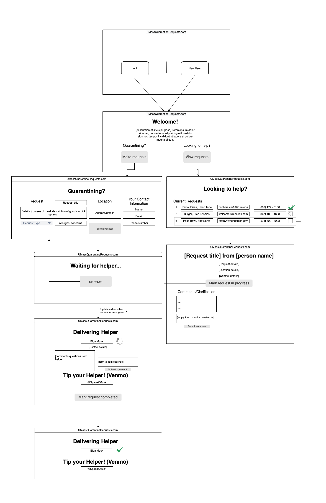

#Milestone#1
<h1>Team VAV</h1>

# Team Overview
Aaron - **OfficialAaronTsui** & **OfficialAaronTsui2**

Griffin Evans - **grievans**

Joseph Yang - **JoJo-19** 

# Data Interactions 
* Users first need to log into an account, making one if they don't have one already. This of course involves interaction with the user data being used to authenticate the logins.

* They can choose between 2 portals: one for quarantining students and another for task helpers. 

    * Quarantining students can enter in their name, location, phone number or email, and what they are requesting (in the form of a title and a description). The text of this request is saved on the server.

        * The name, phone, and email can also be included with the setup of one's account, to be retrieved as a default when making a new request.
        
        * Then the user is sent to a page for waiting for the request to be resolved; here the data being interacted with is a notice of when someone marks the request as being in progress (along with a notice of who that person is), and once that is done the user will receive the information of the user who is helping, with details such as their email and phone number, and optionally a link to payment services that can be used to tip or to cover the cost of goods being retrieved.

            * The quarantining user is also able to send and receive text comments with the helper via the site itself.

            * Once the requested task is completed, the user can mark it as such so that the request no longer appears on the listing for helpers to respond to.

    * Task Helpers can see all requests and choose to contact specific students if they need further clarification. This of course involves the retrieval of the data sent by the requester, such as title, name, and task description.
    
        * Task Helpers can also mark requests as in the process of being completed, which would show as a label in the listing of requests so that others know not to double-up on those requests.

* Relevant data types include names, addresses, contact details, task descriptions, responses/comments, and potentially images integrated into those comments and/or descriptions.

# Wireframes
Below is our wireframe!

# HTML and CSS
Below are screenshots of our web pages!