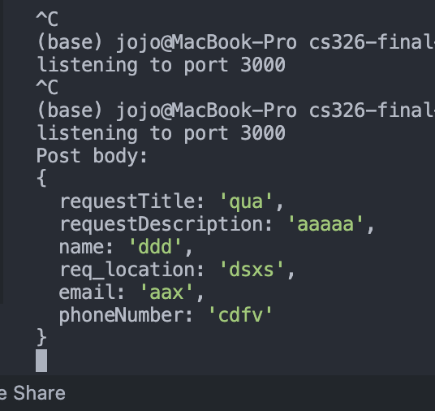
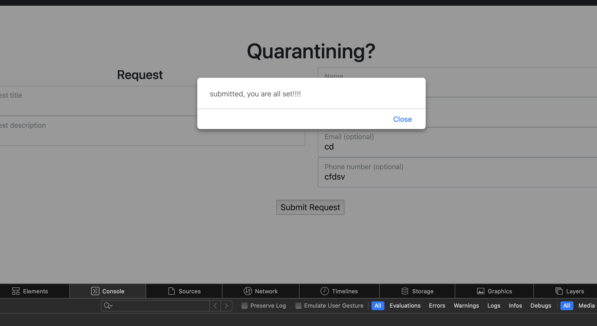
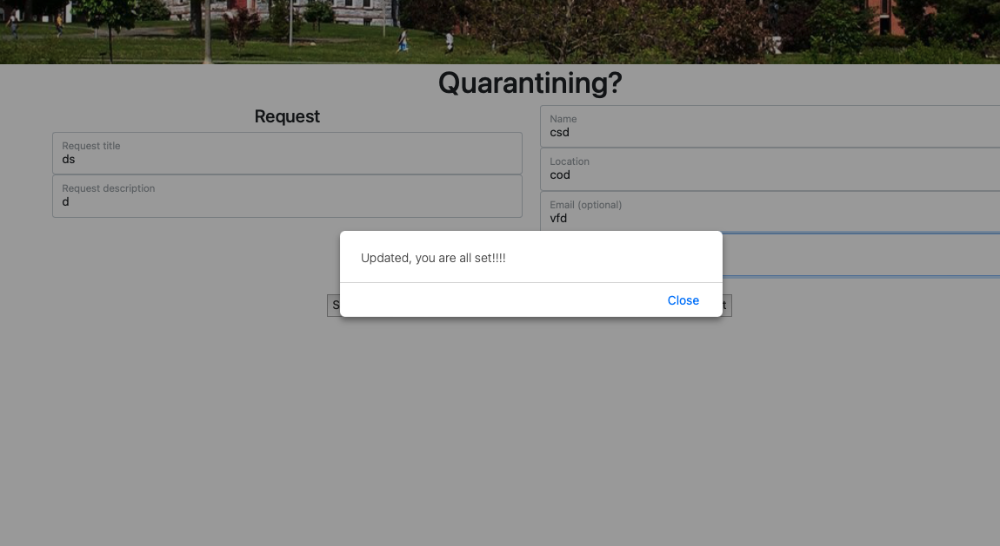
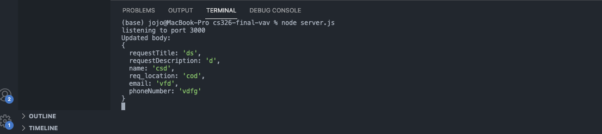
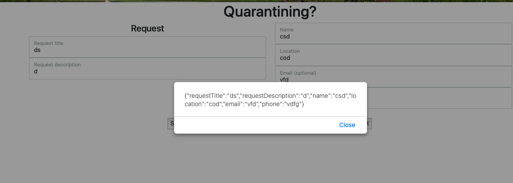
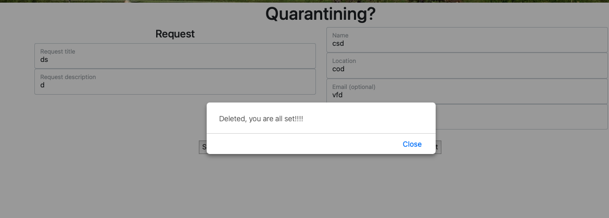
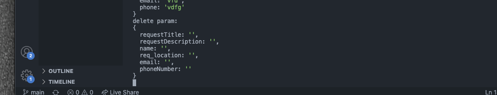
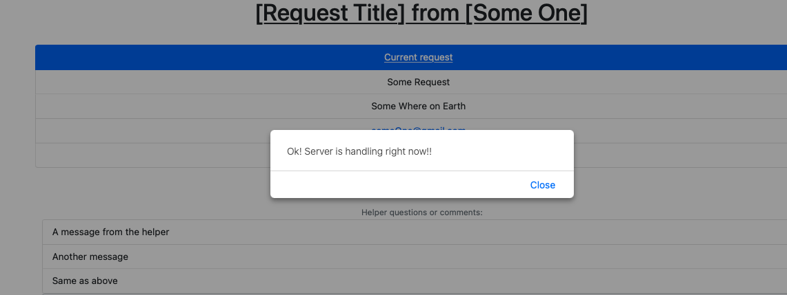
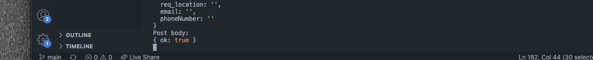

# Milestone 2

## Part 0: Project API Planning

### Login

Gets a token to be used for logging the client into a specified account, given the correct email and password. Note logging out does not depend on any server data, and thus there is not an equivalent operation for that.

**POST** /user/login
<!-- Uses a POST since that seems to be convention for logins as it's not stored locally? -->

*Parameters:*
| Name | Type | In | Description |
|------|------|----|----------|
|user_email|string|header|The email used by the account|
|password|string|header|Password of the account (to be hashed and compared)|
<!-- Seems like hashing would be server side? Not sure, just basing off of what other APIs seem to do. -->

*Response:*

    Status: 200 OK
    {
        "login_status": "valid",
        "session_token": "xxxxxxxxxxx"
    }

<!-- ### Logout (might only need to be client-side?)

...TODO MAYBE DELETE -->

### Create account

Creates a new account, if `user_email` is not already in use. 
<!-- maybe should also return login token? not sure; can just call Login afterwards anyway -->

**POST** /user/new

*Parameters:*

| Name | Type | In | Description |
|------|------|----|----------|
|user_email|string|body|The email to be used for the new account|
|password|string|body|Password to be hashed and set for the account| <!-- TODO again not totally sure how this works -->
|display_name|string|body|If present, sets this name to be shown in the account's contact details.|
|phone_number|string|body|If present, sets this number to be shown in the account's contact details. Note that the type is *string*, not number.|

*Response:*

    Status: 201 Created

If the email is already in use:

    Status: 304 Not Modified

### Edit account

Edits details of this session's account

**PUT** /user/edit

*Parameters:*

| Name | Type | In | Description |
|------|------|----|----------|
|session_token|string|body|The token for the current login session, used to identify the active account.|
|user_email|string|body|If present, an address to change the account's email to.| <!-- maybe shouldn't be changeable? -->
|display_name|string|body|If present, a name to change the account's display name to.|
|phone_number|string|body|If present, what to change the account's phone number to.|
<!-- maybe should also take password? -->

*Response:*

    Status: 204 No Content

If `session_token` is invalid:

    Status: 403 Forbidden

<!-- ^maybe should be 401? Probably doens't matter -->

### Delete account

Marks the user's account to be removed from the database.

**PUT** /user/delete

*Parameters:*

| Name | Type | In | Description |
|------|------|----|----------|
|session_token|string|body|The token for the current login session, used to identify the active account.|

*Response:*

    Status: 204 No Content

If `session_token` is invalid:

    Status: 403 Forbidden

### Get account data

Retrieves the publicly viewable data for an account, specified by the associated email.
<!-- Or maybe should use some separate system of IDs (numerical for instance)? so this wouldn't have to change the input it takes if the account has its email changed. TODO decide, not sure it really matters what we pick for now or not since this works either way for the dummy implementation -->

**GET** /user/data/{target_email}

*Parameters:*

| Name | Type | In | Description |
|------|------|----|----------|
|target_email|string|header|The address of the user to retrieve data for.|
<!-- or maybe should be in path? -->

*Response:*

    Status: 200 OK
    {
        "user": {
            "email": "xxxxxx@example.com",
            "display_name": "Xxxxx Xxx",
            "phone_number": "555-555-5555"
        }
    }

If `target_email` has no matching account:

    404 Not Found

### Create Task
Creates a new request. 

**POST** /task

method: post

*Parameters:*

| requestTitle | requestDescription | name | req_location | email | phoneNumber | 
|--------------|--------------------|------|--------------|-------|-------------|
|requestTitle|string|body|The request to be made.|
|requestDescription|string|body|The description for the request.| 
|name|string|body|Name for the person who submit request.|
|req_location|string|body|Location for the request.|
|email|string|body|Email to reach the person asking for help.|
|phoneNumber|string|body|Phone number to reach the person asking for help.|

*Response:*
    Client side: stored info in req.body and send to server.

    Server: Status: 201 Created. Use req.body to handle it, example output would be:
    Post body: 
{
  requestTitle: '',
  requestDescription: '',
  name: '',
  req_location: '',
  email: '',
  phoneNumber: ''
}

### Get Task Data
Review the request made.

**GET** /task
method: get

*Parameters:*

| requestTitle | requestDescription | name | req_location | email | phoneNumber | 
|--------------|--------------------|------|--------------|-------|-------------|
|requestTitle|string|body|The request to be made.|
|requestDescription|string|body|The description for the request.| 
|name|string|body|Name for the person who submit request.|
|req_location|string|body|Location for the request.|
|email|string|body|Email to reach the person asking for help.|
|phoneNumber|string|body|Phone number to reach the person asking for help.|

*Response:*
    Client side: Request data from server.
    Server: Abstract data from DB(future). Check authentication to proceed/ return(future). Send data to client.

    Example output would be:
    Get param: 
{
  requestTitle: '',
  requestDescription: '',
  name: '',
  req_location: '',
  email: '',
  phoneNumber: ''
}

### Delete Tasks
Delete the requested data.

**DELETE** /task
method: delete

*Parameters:*

| requestTitle | requestDescription | name | req_location | email | phoneNumber | 
|--------------|--------------------|------|--------------|-------|-------------|
|requestTitle|string|body|The request to be made.|
|requestDescription|string|body|The description for the request.| 
|name|string|body|Name for the person who submit request.|
|req_location|string|body|Location for the request.|
|email|string|body|Email to reach the person asking for help.|
|phoneNumber|string|body|Phone number to reach the person asking for help.|

*Response:*
    Client: Request delete from server.
    Server: Delete from DB(future). Let client know it's deleted from DB.
    Example output would be:
    'Deleted, you are all set!!!!'

### Edit Task
Update the requested data.

**PUT** /task
method: put

*Parameters:*

| requestTitle | requestDescription | name | req_location | email | phoneNumber | 
|--------------|--------------------|------|--------------|-------|-------------|
|requestTitle|string|body|The request to be made.|
|requestDescription|string|body|The description for the request.| 
|name|string|body|Name for the person who submit request.|
|req_location|string|body|Location for the request.|
|email|string|body|Email to reach the person asking for help.|
|phoneNumber|string|body|Phone number to reach the person asking for help.|

*Response:*
    Client side: stored info in req.body and send to server.

    Server: Status: 201 Created. Use req.body to handle it, example output would be:
    Post body: 
{
  requestTitle: '',
  requestDescription: '',
  name: '',
  req_location: '',
  email: '',
  phoneNumber: ''
}

### Task Progress
Mark/ update task progress.

**POST** /markProgress
method: post

*Response:*
    Client: Let the client know task status has changed.
    Server: Change status.html to 'in progress'
    Sample dummy output:
    Post body: 
{ ok: true }

### Create Comment

create comment, get list of comments for a task?

**POST** /comment/{commentId}

Requester creates new comment with commentId, server stores comment with requestId.

*Parameters:*
| Name | Type | In | Description |
|------|------|----|-------------|
requestId | integer | query | Identification Number for the request.
commentId | integer |path |Identification Number for the comment.

*Response:*

    Status: 200 OK
    {
        "comment_creation": "successful",
        "session_token": "xxxxxxxxxxx"
    }

### Get comments
**GET** /comment/all
Helper gets all comments.

*Parameters:*
| Name | Type | In | Description |
|------|------|----|-------------|
requestId | integer | query | Identification Number for the request.
all | string |path |maximum number of comments to show parameter.

*Response:*

    Status: 200 OK
    {
        "all_comments": "true",
        "session_token": "xxxxxxxxxxx"
    }

## Part 1: Back-end Skeleton Code

Dummy server implemented.

## Part 2: Front-end Implementation

## Part 3: Deployment

https://cs326-final-vav-project.herokuapp.com/

## Division of labor

Griffin: All of account/login

Aaron: All of Comment/creation/deletion

Joseph: All of Task-based Create request/ Update request/ Get request/ Delete request
